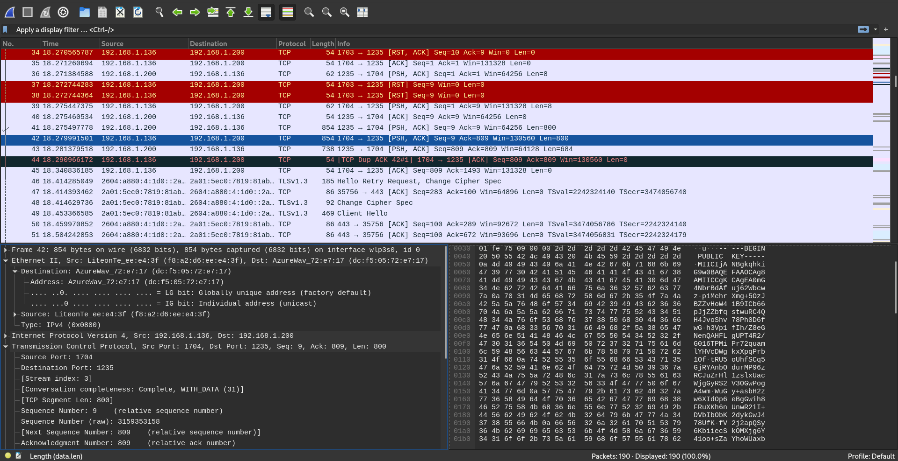

# py-socket-secure-transfer
simple showcase of encryption on TCP packets with wireshark examples

## Overview


py-socket-secure-transfer is a simple pythonic showcase of encryption on TCP packets. It provides clean and easy to understand source code that helps people understanding how their data would be when they use encrypted environments to share their data. The source code also provides a simple (thus non-standard) shape of custom protocol that handles some operations on a connection.

## Installation
To install and run py-socket-secure-transfer, follow these steps:

##### Clone the repository:
You should first download the repo or clone it using git:
```bash
git clone https://github.com/0xDeviI/py-socket-secure-transfer.git
```

##### Install the required dependencies:
Then you should install dependencies of the project using [pip](https://pip.pypa.io/en/stable/getting-started/):
```bash
pip install -r requirements.txt
```

## Usage
You should decide what do you want to run on your own system, a server, a client or both?
To run the server, use this command:
```bash
python3 server.py --ip/-i [IP_ADDR] --port/-p [PORT]
```
and to run client, use this command:
```bash
python3 client.py --ip/-i [SERVER_IP_ADDR] --port/-p [SERVER_PORT]
```
If you want to use encrypted channel, add `-e -u [USERNAME]` to the above commands like:
```bash
python3 server.py --ip/-i [IP_ADDR] --port/-p [PORT] -e -u [USERNAME]
```
This command would create a directory named `keys/[USERNAME]` which your temporary public and private keys gets stored in there.
> :warning: **Same Channel Communication**: Both your server and client should use same channel for communication. Means if your server uses encryption, you can't connect to that server using a non-encrypted channel from a client, vice versa is the same.


## Project Structure

The project is organized into the following modules:

- `server.py`: The server implementation of the project.
- `client.py`: The client implementation of the project.
- `protocol/messages.py`: This file contains protocol messages and a function to determine proto messages.
- `utils/netaddr.py`: Just a utility class helping the server code.
- `utils/rsa.py`: This file is used on cryptographic tasks such as generating RSA key-pairs, encryption, decryption etc.

## Contributions
Contributions to py-socket-secure-transfer are welcome and encouraged! Here's how you can contribute:

1. Fork the repository.
2. Create a new branch: `git checkout -b feature/my-feature`
3. Make your changes and commit them: `git commit -am 'Add new feature'`.
4. Push the branch: `git push origin feature/my-feature`.
5. Submit a pull request.

Please ensure that your contributions adhere to the project's coding standards and guidelines.

## Issues
If you encounter any issues or have suggestions for improvements, please report them in the Issues section of the repository.

## License
The project is licensed under the MIT. See the LICENSE file for more details.


## Acknowledgements
This project is just a showcase to help newbies to the networking (or programming) to understand better the concepts of a secure (or at least semi-secure) networking communication. Using the code as what it is, is not recommended.